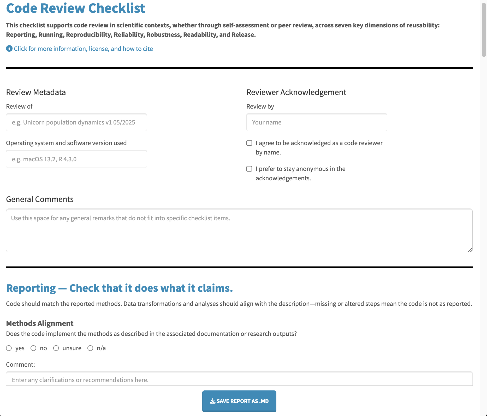

[![CC BY-NC 4.0][cc-by-nc-shield]][cc-by-nc]

[cc-by-nc]: https://creativecommons.org/licenses/by-nc/4.0/
[cc-by-nc-shield]: https://img.shields.io/badge/License-CC%20BY--NC%204.0-lightgrey.svg


# Code Review Checklist – Shiny App

---

### About

This Shiny app supports code review for scientists —whether through self-assessment or peer review— by offering specific prompts for evaluating and improving the code's technical functionality and documentation across seven key dimensions of reusability:  
Reporting, Running, Reproducibility, Reliability, Robustness, Readability, and Release.  

**How to use this app locally:**
1. Download the file (`app.R`) and open it in R or RStudio.
2. To start the app, either:
   a) run the script in its entirety, or
   b) in the Console, run the following:
     ```r
     setwd("path/to/your/appfolder")  # Provide path to directory where app.R is saved!
     shiny::runApp()
     ```
3. Once the app opens in your browser:
   - fill in the metadata section at the top
   - work through the checklist and add comments if needed
   - click “save report as .md” to download your review as a Markdown file
4. You can then edit, save, convert, and share the report as you like

---

### Requirements

This app was developed and tested on the following versions; other versions may work, but these were used during development:

- macOS 15.4.1  
- R version 4.4.3  

Required R packages, tested versions:

- `shiny`: `1.10.0`  
- `shinyjs`: `2.1.0`  
- `shinythemes`: `1.2.0`

The script checks for these packages and installs them if missing.

---

### Preview

Here's a screenshot of the app's user interface:



---

### License and Attribution

This checklist and the app are shared under a [CC BY-NC 4.0 License](https://creativecommons.org/licenses/by-nc/4.0/), allowing reuse and adaptation for non-commercial purposes, provided attribution is given. If you use, build on, or adapt this app, please attribute as follows:

> Adapted from the Code Review Checklist available at https://github.com/fhillemann/code_review_checklist (TO DO: "and archived at https://doi.org/10.12345/zenodo.12345"), licensed under CC BY-NC 4.0.

---

### Associated Paper

This app accompanies a paper that outlines the need for code review to strengthen reproducibility and collaboration in computational biology, and in scientific research more broadly. The abstract is included below. The manuscript is freely available as an open access preprint:

> Hillemann F, Burant JB, Culina A, Vriend SJG. (2025). Code Review in Practice: A Checklist for Computational Reproducibility and Collaborative Research in Ecology and Evolution. *EcoEvoRxiv* Preprint Server. [https://doi.org/10.32942/X26S6P](https://doi.org/10.32942/X26S6P) 

**Abstract**  
Ensuring that research, along with its data and code, is credible and remains accessible is crucial for advancing scientific knowledge — especially in ecology and evolutionary biology, where the climate crisis and biodiversity loss demand urgent, transparent science. Yet, code is rarely shared alongside scientific publications, and when it is, unclear implementation and poor documentation often make it difficult to use. Code review — whether as self-assessment or peer review — can improve key aspects of code quality: reusability, i.e., ensuring technical functionality and documentation, and validity, i.e., ensuring the code implements the intended analyses faithfully. While assessing validity requires domain expertise, reviewing for reusability can be done by anyone with basic programming knowledge. We introduce a checklist-based, customisable approach to code review focused on reusability. Informed by best practices in software development and community recommendations, the checklist organises prompts around seven key attributes of reusable scientific code: Reporting, Running, Reliability, Reproducibility, Robustness, Readability, and Release. By defining and structuring these principles and turning them into a practical tool, our template supports a systematic yet flexible review process. It also offers researchers a clear path to improve their own code. Ultimately, this approach reinforces reproducible coding practices and strengthens both the credibility and collaborative potential of research.

---
